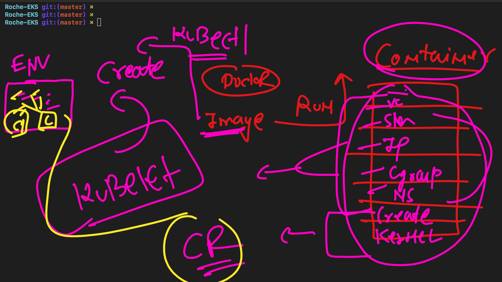
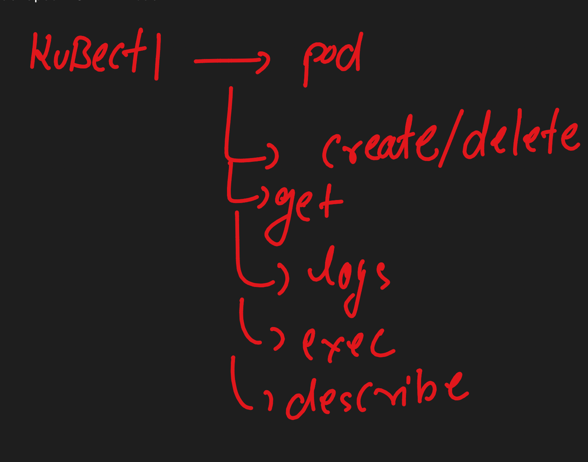
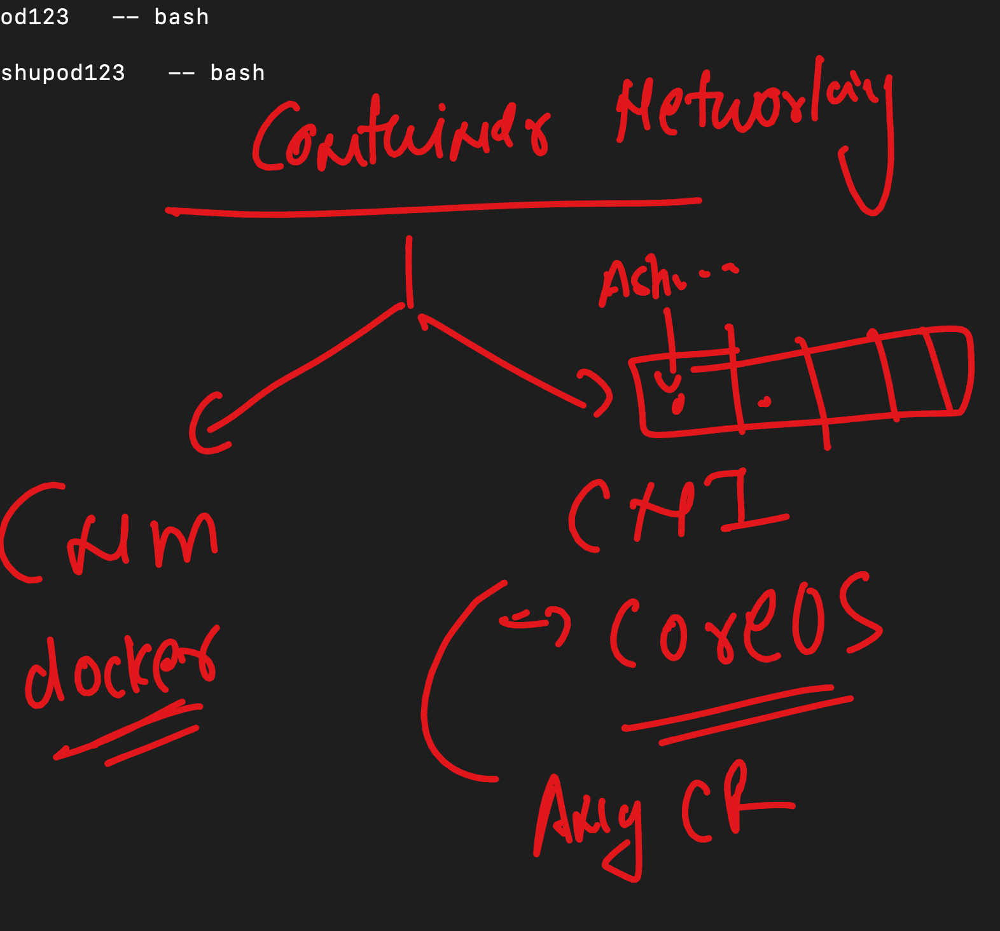

# Roche-EKS

### Container orchestration 


### More info about k8s


### on K8s client machine checking kubectl version 

```
 kubectl version --client 
Client Version: v1.29.1
Kustomize Version: v5.0.4-0.20230601165947-6ce0bf390ce3
➜  Roche-EKS git:(master) 


====>>
 kubectl version --client   -o yaml 
clientVersion:
  buildDate: "2024-01-17T15:51:03Z"
  compiler: gc
  gitCommit: bc401b91f2782410b3fb3f9acf43a995c4de90d2
  gitTreeState: clean
  gitVersion: v1.29.1
  goVersion: go1.21.6
  major: "1"
  minor: "29"
  platform: darwin/amd64
kustomizeVersion: v5.0.4-0.20230601165947-6ce0bf390ce3


➜  Roche-EKS git:(master) kubectl version --client   -o json 
{
  "clientVersion": {
    "major": "1",
    "minor": "29",
    "gitVersion": "v1.29.1",
    "gitCommit": "bc401b91f2782410b3fb3f9acf43a995c4de90d2",
    "gitTreeState": "clean",
    "buildDate": "2024-01-17T15:51:03Z",
    "goVersion": "go1.21.6",
    "compiler": "gc",
    "platform": "darwin/amd64"
  },
  "kustomizeVersion": "v5.0.4-0.20230601165947-6ce0bf390ce3"
}

```

### APIserver


### EKS 


## EKS setup 


### Creating new VPC 

[click_here](https://docs.aws.amazon.com/eks/latest/userguide/creating-a-vpc.html)


### CREATING ROLE FOR EKS CONTROL Plane 

### getting EKS cred in your system 

### aws configure 
```
aws configure 
```

### aws eks 

```
aws eks --region us-east-1 update-kubeconfig --name roche-eks-cp 
```

### checking current cluster 

```
 kubectl  config  get-contexts 
CURRENT   NAME                                                      CLUSTER                                                   AUTHINFO                                                  NAMESPACE
          arn:aws:eks:us-east-1:751136288263:cluster/ekashu-poc     arn:aws:eks:us-east-1:751136288263:cluster/ekashu-poc     arn:aws:eks:us-east-1:751136288263:cluster/ekashu-poc     
*         arn:aws:eks:us-east-1:751136288263:cluster/roche-eks-cp   arn:aws:eks:us-east-1:751136288263:cluster/roche-eks-cp   arn:aws:eks:us-east-1:751136288263:cluster/roche-eks-cp   
➜  Roche-EKS git:(master) ✗ 

```

### checking option

```
kubectl  cluster-info 
Kubernetes control plane is running at https://E86CD6B5217AB19B984D52D469487395.yl4.us-east-1.eks.amazonaws.com
CoreDNS is running at https://E86CD6B5217AB19B984D52D469487395.yl4.us-east-1.eks.amazonaws.com/api/v1/namespaces/kube-system/services/kube-dns:dns/proxy

```

### checking nodes from kubectl

```
 Roche-EKS git:(master) ✗ kubectl get  nodes        
NAME                             STATUS   ROLES    AGE   VERSION
ip-192-168-127-81.ec2.internal   Ready    <none>   11m   v1.29.0-eks-5e0fdde
ip-192-168-17-188.ec2.internal   Ready    <none>   11m   v1.29.0-eks-5e0fdde
➜  Roche-EKS git:(master) ✗ kubectl get  nodes -o wide
NAME                             STATUS   ROLES    AGE   VERSION               INTERNAL-IP      EXTERNAL-IP   OS-IMAGE         KERNEL-VERSION                  CONTAINER-RUNTIME
ip-192-168-127-81.ec2.internal   Ready    <none>   11m   v1.29.0-eks-5e0fdde   192.168.127.81   3.85.14.74    Amazon Linux 2   5.10.213-201.855.amzn2.x86_64   containerd://1.7.11
ip-192-168-17-188.ec2.internal   Ready    <none>   11m   v1.29.0-eks-5e0fdde   192.168.17.188   3.83.161.53   Amazon Linux 2   5.10.213-201.855.amzn2.x86_64   containerd://1.7.11
```

### Intro to Pod in K8s 




### Creating pod 

```
 Roche-EKS git:(master) ✗ kubectl   get  pods 
No resources found in default namespace.
➜  Roche-EKS git:(master) ✗ 
➜  Roche-EKS git:(master) ✗ 
➜  Roche-EKS git:(master) ✗ kubectl  run  ashupod1  --image=nginx   --port 80 
pod/ashupod1 created
➜  Roche-EKS git:(master) ✗ kubectl   get  pods                               
NAME           READY   STATUS             RESTARTS      AGE
ajay           1/1     Running            0             9s
ajayspod       0/1     Error              2 (23s ago)   24s
akankshapod1   1/1     Running            0             25s
ashupod1       1/1     Running            0             26s
jaipod1        1/1     Running            0             26s
mrbm007        1/1     Running            0             12s
ninad10        1/1     Running            0             27s
niranjan       0/1     ImagePullBackOff   0             22s
pody1          1/1     Running            0             50s
ranjith-pod    1/1     Running            0             12s
rpnode1        1/1     Running            0             24s

```

### more info about pod 

```
kubectl  get no                   
NAME                             STATUS   ROLES    AGE   VERSION
ip-192-168-127-81.ec2.internal   Ready    <none>   38m   v1.29.0-eks-5e0fdde
ip-192-168-17-188.ec2.internal   Ready    <none>   38m   v1.29.0-eks-5e0fdde
➜  Roche-EKS git:(master) ✗ 
➜  Roche-EKS git:(master) ✗ 
➜  Roche-EKS git:(master) ✗ kubectl   get  pods               
NAME           READY   STATUS             RESTARTS       AGE
ajay           1/1     Running            0              10m
ajayspod       0/1     CrashLoopBackOff   6 (5m1s ago)   10m
ajayspod1      1/1     Running            0              8m27s
akankshapod1   1/1     Running            0              10m
ashupod1       1/1     Running            0              10m
jaipod1        1/1     Running            0              10m
mrbm007        1/1     Running            0              10m
ninad10        1/1     Running            0              10m
niranjan       0/1     ImagePullBackOff   0              10m
niranjan1      1/1     Running            0              9m28s
pody1          1/1     Running            0              11m
ranjith-pod    1/1     Running            0              10m
rpnode1        1/1     Running            0              10m
shivraj1       1/1     Running            0              11m
testvishal     1/1     Running            0              11m
vijaytestpod   1/1     Running            0              10m
➜  Roche-EKS git:(master) ✗ kubectl   get  pods  ashupod1  -o wide 
NAME       READY   STATUS    RESTARTS   AGE   IP               NODE                             NOMINATED NODE   READINESS GATES
ashupod1   1/1     Running   0          10m   192.168.19.173   ip-192-168-17-188.ec2.internal   <none>           <none>
➜  Roche-EKS git:(master) ✗ 


```

### deleting pods

```
 Roche-EKS git:(master) ✗ kubectl  delete pods  ashupod1
Error from server (NotFound): pods "ashupod1" not found
➜  Roche-EKS git:(master) ✗ kubectl get pods
No resources found in default namespace.
➜  Roche-EKS git:(master) ✗ 
➜  Roche-EKS git:(master) ✗ kubectl  delete pods --all  


```

### Creating pod using manifest

```
 ls
ashupod1.yaml
➜  ashu-k8s-manifest git:(master) ✗ kubectl  create  -f  ashupod1.yaml 
pod/ashupod123 created
➜  ashu-k8s-manifest git:(master) ✗ 

```

### Creating pod yaml /json file using kubectl 

```
 
➜  Roche-EKS git:(master) ✗ kubectl  run  ashupod1  --image=nginx   --port 80   --dry-run=client 
pod/ashupod1 created (dry run)
➜  Roche-EKS git:(master) ✗ 
➜  Roche-EKS git:(master) ✗ kubectl  run  ashupod1  --image=nginx   --port 80   --dry-run=client  -o yaml 
apiVersion: v1
kind: Pod
metadata:
  creationTimestamp: null
  labels:
    run: ashupod1
  name: ashupod1
spec:
  containers:
  - image: nginx
    name: ashupod1
    ports:
    - containerPort: 80
    resources: {}
  dnsPolicy: ClusterFirst
  restartPolicy: Always
status: {}
➜  Roche-EKS git:(master) ✗ kubectl  run  ashupod1  --image=nginx   --port 80   --dry-run=client  -o json 
{
    "kind": "Pod",
    "apiVersion": "v1",

```

### checking logs of container inside pod 

```
 Roche-EKS git:(master) ✗ kubectl  logs  ashupod123  
/docker-entrypoint.sh: /docker-entrypoint.d/ is not empty, will attempt to perform configuration
/docker-entrypoint.sh: Looking for shell scripts in /docker-entrypoint.d/
/docker-entrypoint.sh: Launching /docker-entrypoint.d/10-listen-on-ipv6-by-default.sh
10-listen-on-ipv6-by-default.sh: info: Getting the checksum of /etc/nginx/conf.d/default.conf
10-listen-on-ipv6-by-default.sh: info: Enabled listen on IPv6 in /etc/nginx/conf.d/default.conf
/docker-entrypoint.sh: Sourcing /docker-entrypoint.d/15-local-resolvers.envsh
/docker-entrypoint.sh: Launching /docker-entrypoint.d/20-envsubst-on-templates.sh
/docker-entrypoint.sh: Launching /docker-entrypoint.d/30-tune-worker-processes.sh
/docker-entrypoint.sh: Configuration complete; ready for start up
2024/04/15 11:39:51 [notice] 1#1: using the "epoll" event method
2024/04/15 11:39:51 [notice] 1#1: nginx/1.25.4

```

### we can get shell of containers inside pods

```
 Roche-EKS git:(master) ✗ kubectl  exec  -it  ashupod123   -- bash 
root@ashupod123:/# 
root@ashupod123:/# 
root@ashupod123:/# cat /etc/os-release 
PRETTY_NAME="Debian GNU/Linux 12 (bookworm)"
NAME="Debian GNU/Linux"
VERSION_ID="12"
VERSION="12 (bookworm)"
VERSION_CODENAME=bookworm
ID=debian
HOME_URL="https://www.debian.org/"
SUPPORT_URL="https://www.debian.org/support"
BUG_REPORT_URL="https://bugs.debian.org/"
root@ashupod123:/# id
uid=0(root) gid=0(root) groups=0(root)
root@ashupod123:/# mkdir  hello
root@ashupod123:/# exit
exit

```

### pod commands info 



## Intro to Container Networking 



