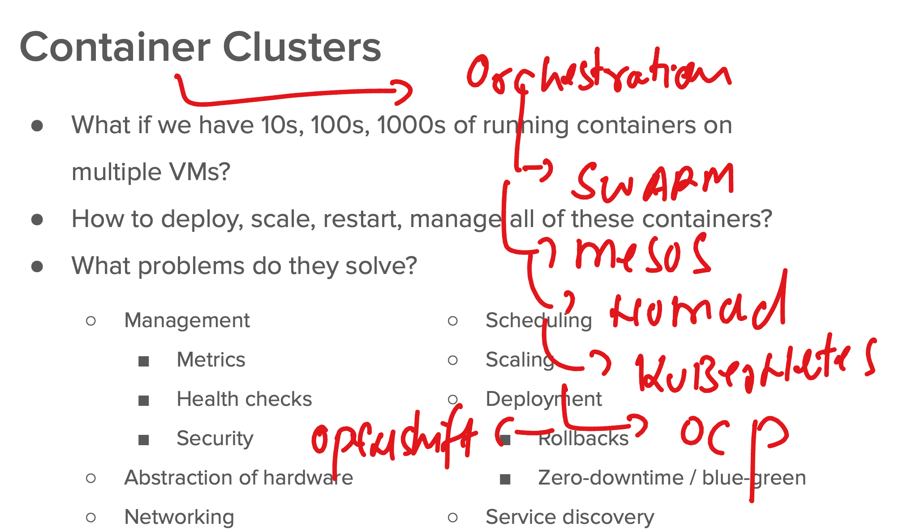
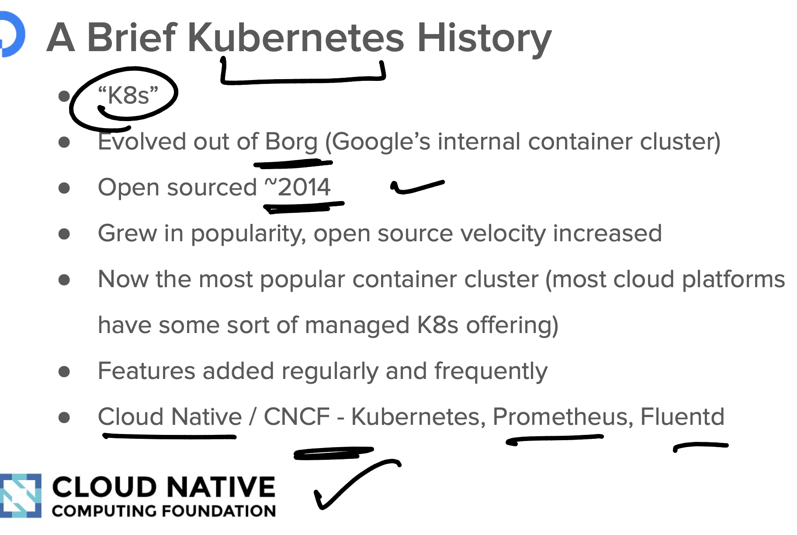
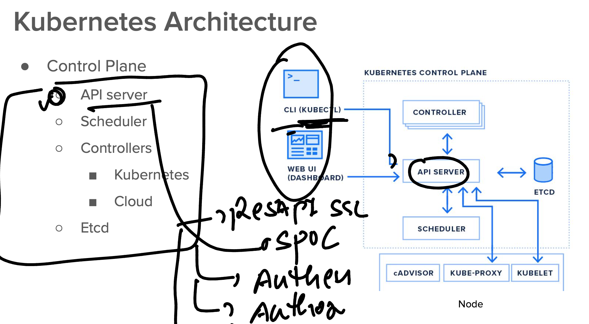
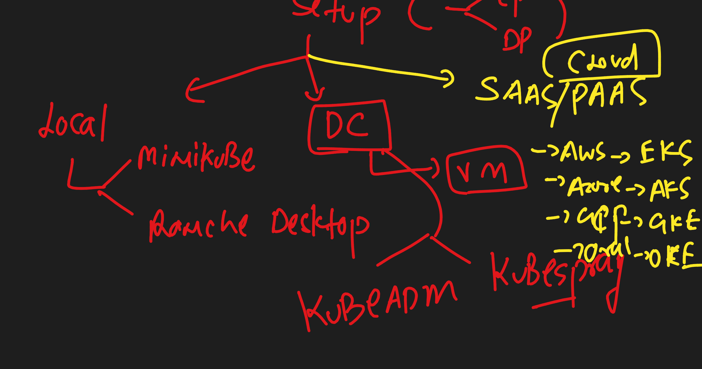

# Roche-EKS

### Container orchestration 



### More info about k8s



### on K8s client machine checking kubectl version 

```
 kubectl version --client 
Client Version: v1.29.1
Kustomize Version: v5.0.4-0.20230601165947-6ce0bf390ce3
➜  Roche-EKS git:(master) 


====>>
 kubectl version --client   -o yaml 
clientVersion:
  buildDate: "2024-01-17T15:51:03Z"
  compiler: gc
  gitCommit: bc401b91f2782410b3fb3f9acf43a995c4de90d2
  gitTreeState: clean
  gitVersion: v1.29.1
  goVersion: go1.21.6
  major: "1"
  minor: "29"
  platform: darwin/amd64
kustomizeVersion: v5.0.4-0.20230601165947-6ce0bf390ce3


➜  Roche-EKS git:(master) kubectl version --client   -o json 
{
  "clientVersion": {
    "major": "1",
    "minor": "29",
    "gitVersion": "v1.29.1",
    "gitCommit": "bc401b91f2782410b3fb3f9acf43a995c4de90d2",
    "gitTreeState": "clean",
    "buildDate": "2024-01-17T15:51:03Z",
    "goVersion": "go1.21.6",
    "compiler": "gc",
    "platform": "darwin/amd64"
  },
  "kustomizeVersion": "v5.0.4-0.20230601165947-6ce0bf390ce3"
}

```

### APIserver



### EKS 



## EKS setup 


### Creating new VPC 

[click_here](https://docs.aws.amazon.com/eks/latest/userguide/creating-a-vpc.html)


### CREATING ROLE FOR EKS CONTROL Plane 

```

```
