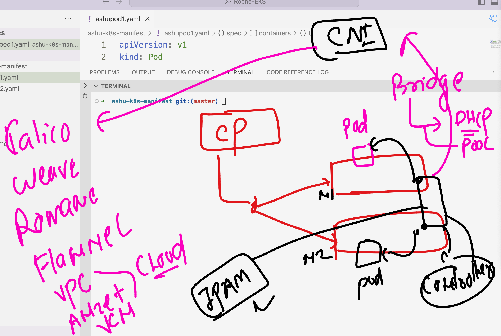
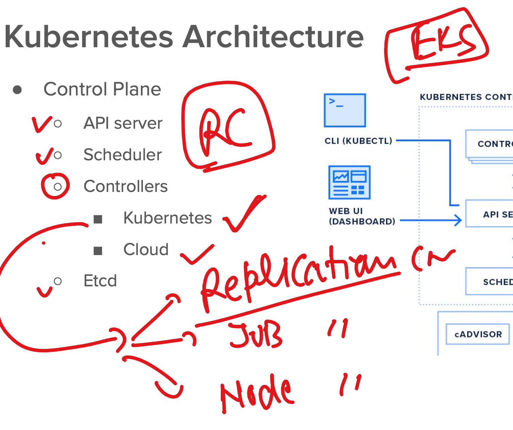
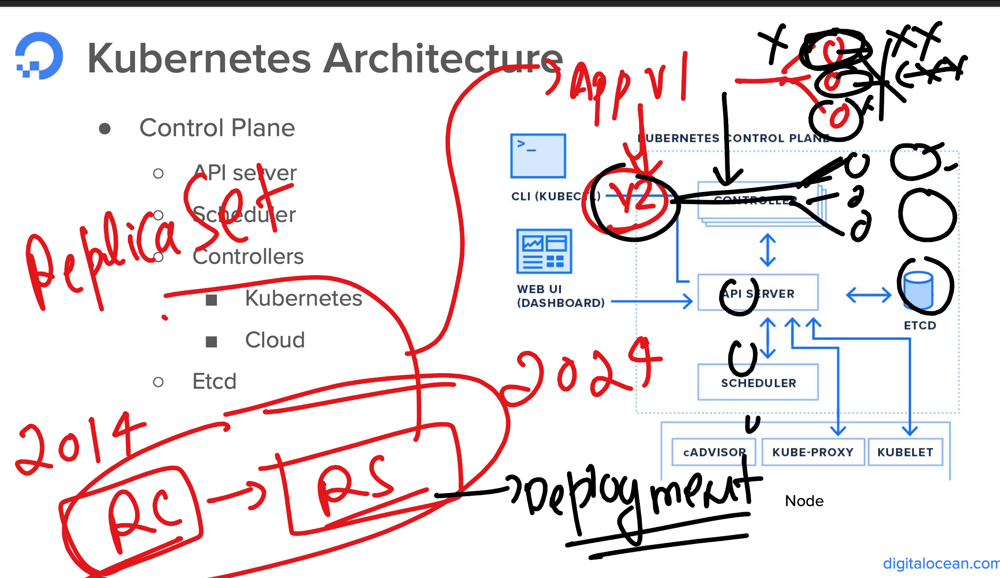
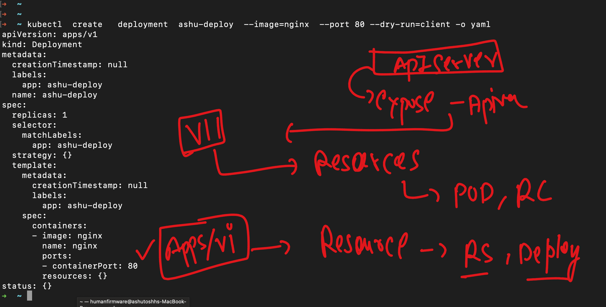
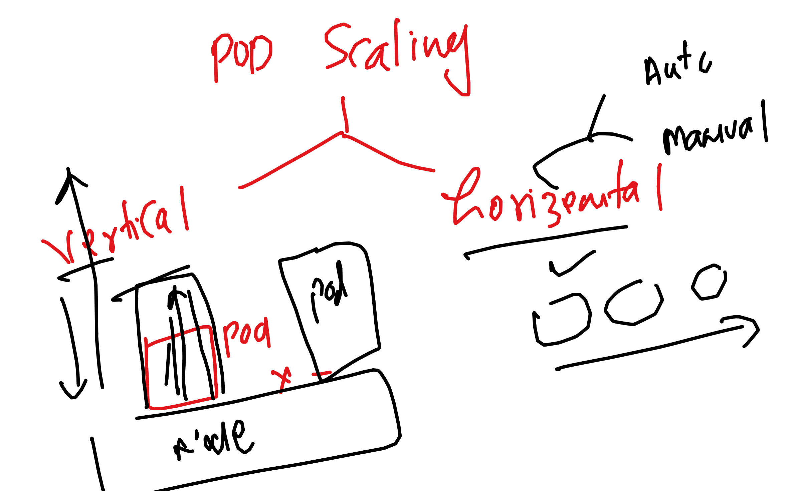
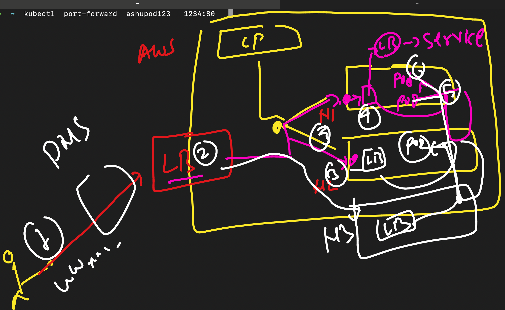

# Roche-EKS

### EKS info 


### CNI info 



### Intro to controller in eks



### Introduction to controller 



### New apiVersion for RS & deployment 



### Creating YAML for Deployment 

```
kubectl  create   deployment  ashu-deploy  --image=nginx  --port 80 --dry-run=client -o yaml

```

### Creating deployment 

```
 ashu-k8s-manifest git:(master) ✗ kubectl  create  -f  ashudeploy.yaml 
deployment.apps/ashu-deploy created
➜  ashu-k8s-manifest git:(master) ✗ kubectl  get deploy
NAME              READY   UP-TO-DATE   AVAILABLE   AGE
ajaychavda        1/1     1            1           2s
akanksha-deploy   0/1     1            0           1s
ashu-deploy       1/1     1            1           6s
auto-deploy       0/1     1            0           1s
jai-deploy        0/1     1            0           1s
vj-deployment     1/1     1            1           2s
➜  ashu-k8s-manifest git:(master) ✗ kubectl  get  rs   
NAME                         DESIRED   CURRENT   READY   AGE
ajaychavda-74fc465dd8        1         1         1       10s
akanksha-deploy-6d6fb58df6   1         1         1       9s
ashu-deploy-676d64ddbf       1         1         1       14s
auto-deploy-6756b45fd5       1         1         1       9s
jai-deploy-f95879f8          1         1         1       9s
rp-deployment1-5c86756969    1         1         1       7s
vj-deployment-94b9b7b98      1         1         1       10s
➜  ashu-k8s-manifest git:(master) ✗ kubectl  get  pod 
NAME                               READY   STATUS    RESTARTS   AGE
ajaychavda-74fc465dd8-fkxkg        1/1     Running   0          32s
akanksha-deploy-6d6fb58df6-9kcld   1/1     Running   0          31s
ashu-deploy-676d64ddbf-hbgwd       1/1     Running   0          36s
auto-deploy-6756b45fd5-4g5sj       1/1     Running   0          31s
jai-deploy-f95879f8-q4dp2          1/1     Running   0          31s
nci-nginx-c5d7b4bf5-jkn9q          1/1     Running   0          17s
nci-nginx-c5d7b4bf5-w6xj2          1/1     Running   0          17s
niranjan-deploy-64765f4769-2fpjl   1/1     Running   0          14s
ranjith-deploy-99b4b894b-xs8ml     1/1     Running   0          7s
rp-deployment1-5c86756969-c4f4r    1/1     Running   0          29s
```

### scaling pod 




### manual horizent pod scaling by Deployment 

```
kubectl  scale deployment ashu-deploy  --replicas=3
deployment.apps/ashu-deploy scaled
➜  ashu-k8s-manifest git:(master) ✗ kubectl get deploy
NAME              READY    UP-TO-DATE   AVAILABLE   AGE
ajaychavda        1/1      1            1           12m
ajays-deploy      1/1      1            1           9m37s
akanksha-deploy   1/1      1            1           12m
ashu-deploy       3/3      3            3           12m
jai-deploy        2/2      2            2           12m
myapp             14/100   100          14          6m54s
```

### Kubernets LB 



### type of service in K8s 

```
kubectl   create  service                      
Create a service using a specified subcommand.

Aliases:
service, svc

Available Commands:
  clusterip      Create a ClusterIP service
  externalname   Create an ExternalName service
  loadbalancer   Create a LoadBalancer service
  nodeport       Create a NodePort service

Usage:
  kubectl create service [flags] [options]

Use "kubectl create service <command> --help" for more information about a given command.
Use "kubectl options" for a list of global command-line options (applies to all commands).
```

### Creating External & itnerlb 


```
 kubectl  expose  deployment  ashu-deploy --type LoadBalancer --port 80 --name ashulb1 --dry-run=client -o yaml 

apiVersion: v1
kind: Service
metadata:
  creationTimestamp: null
  labels:
    app: ashu-deploy
  name: ashulb1
spec:
  ports:
  - port: 80
    protocol: TCP
    targetPort: 80
  selector:
    app: ashu-deploy
  type: LoadBalancer
status:
  loadBalancer: {}
➜  ashu-k8s-manifest git:(master) ✗ kubectl  expose  deployment  ashu-deploy --type LoadBalancer --port 80 --name ashulb1 --dry-run=client -o yaml 
 >ashulbnew1.yaml 
➜  ashu-k8s-manifest git:(master) ✗ kubectl create -f ashulbnew1.yaml 
service/ashulb1 created
➜  ashu-k8s-manifest git:(master) ✗ 

```

### checking service 

```
 kubectl  get service
NAME         TYPE           CLUSTER-IP       EXTERNAL-IP                                                               PORT(S)        AGE
ashulb1      LoadBalancer   10.100.194.211   ad1a64a22e9584e5f9b978bef93bf0c0-1418892613.us-east-1.elb.amazonaws.com   80:31234/TCP   119s
jailb        LoadBalancer   10.100.168.186   a47eab2e4688546c082880702ac6527b-1186562089.us-east-1.elb.amazonaws.com   80:31851/TCP   97s
kubernetes   ClusterIP      10.100.0.1       <none>                                                                    443/TCP        69m
lbname       LoadBalancer   10.100.115.48    <pending>                                                                 80:32764/TCP   2s
shivrajlb1   ClusterIP      10.100.195.222   <none>                                                                    80/TCP         64s
vishalb      LoadBalancer   10.100.221.77    aaabe799275b44b61a14d469b4367906-2108821066.us-east-1.elb.amazonaws.com   80:31155/TCP   42s
```

### Intro to Ingress controller 


### creating namespace 

```
kubectl  get  namespaces
NAME              STATUS   AGE
default           Active   25h
kube-node-lease   Active   25h
kube-public       Active   25h
kube-system       Active   25h
vishalns          Active   74s
➜  ~ 
➜  ~ kubectl  create  namespace  ashu-apps --dry-run=client -o yaml 
apiVersion: v1
kind: Namespace
metadata:
  creationTimestamp: null
  name: ashu-apps
spec: {}
status: {}
➜  ~ kubectl  create  namespace  ashu-apps                          
namespace/ashu-apps created
➜  ~ kubectl  get  ns                                               
NAME              STATUS   AGE
ashu-apps         Active   10s
default           Active   25h
jains             Active   7s
kube-node-lease   Active   25h
kube-public       Active   25h
kube-system       Active   25h
vishalns          Active   2m34s

```

### setting default namespace 

```
kubectl config set-context --current --namespace ashu-apps
Context "arn:aws:eks:us-east-1:751136288263:cluster/roche-eks-cp" modified.
➜  ~ 
➜  ~ kubectl  get pods                                         
No resources found in ashu-apps namespace.
```
### checking current namespace

```
kubectl  config get-contexts                              
CURRENT   NAME                                                      CLUSTER                                                   AUTHINFO                                                  NAMESPACE
*         arn:aws:eks:us-east-1:751136288263:cluster/roche-eks-cp   arn:aws:eks:us-east-1:751136288263:cluster/roche-eks-cp   arn:aws:eks:us-east-1:751136288263:cluster/roche-eks-cp   ashu-apps
➜  ~ 
```

### Creating deployment and ClustrerIP type service to personal namespace

```
ashu-k8s-manifest git:(master) ✗ kubectl  get deploy
NAME          READY   UP-TO-DATE   AVAILABLE   AGE
ashu-deploy   1/1     1            1           2m11s
➜  ashu-k8s-manifest git:(master) ✗ kubectl  expose deployment  ashu-deploy  --type ClusterIP --port 80 --name ashulbinternal --dry-run=client -o y
aml  >internalbks.yml 
➜  ashu-k8s-manifest git:(master) ✗ kubectl apply -f internalbks.yml 
service/ashulbinternal created
➜  ashu-k8s-manifest git:(master) ✗ kubectl  get svc
NAME             TYPE        CLUSTER-IP       EXTERNAL-IP   PORT(S)   AGE
ashulbinternal   ClusterIP   10.100.213.158   <none>        80/TCP    7s
➜  ashu-k8s-manifest git:(master) ✗ 

```

### list of all Resources 

```
kubectl   api-resources 
NAME                              SHORTNAMES   APIVERSION                        NAMESPACED   KIND
bindings                                       v1                                true         Binding
componentstatuses                 cs           v1                                false        ComponentStatus
configmaps                        cm           v1                                true         ConfigMap
endpoints                         ep           v1                                true         Endpoints
events                            ev           v1                                true         Event
limitranges                       limits       v1                                true         LimitRange
namespaces                        ns           v1                                false        Namespace
nodes                             no           v1                                false        Node
persistentvolumeclaims            pvc          v1                                true         PersistentVolumeClaim
persistentvolumes                 pv           v1                                false        PersistentVolu
```

## Deploy nginx ingress controller in EKS 

```
kubectl apply -f https://raw.githubusercontent.com/kubernetes/ingress-nginx/main/deploy/static/provider/aws/deploy.yaml
namespace/ingress-nginx created
serviceaccount/ingress-nginx created
serviceaccount/ingress-nginx-admission created
role.rbac.authorization.k8s.io/ingress-nginx created
role.rbac.authorization.k8s.io/ingress-nginx-admission created
clusterrole.rbac.authorization.k8s.io/ingress-nginx created
clusterrole.rbac.authorization.k8s.io/ingress-nginx-admission created
rolebinding.rbac.authorization.k8s.io/ingress-nginx created
rolebinding.rbac.authorization.k8s.io/ingress-nginx-admission created
clusterrolebinding.rbac.authorization.k8s.io/ingress-nginx created
clusterrolebinding.rbac.authorization.k8s.io/ingress-nginx-admission created
configmap/ingress-nginx-controller created
service/ingress-nginx-controller created
service/ingress-nginx-controller-admission created
deployment.apps/ingress-nginx-controller created
job.batch/ingress-nginx-admission-create created
job.batch/ingress-nginx-admission-patch created
ingressclass.networking.k8s.io/nginx created
validatingwebhookconfiguration.admissionregistration.k8s.io/ingress-nginx-admission created

```

### verify 

```
 kubectl  get  deploy  -n  ingress-nginx  
NAME                       READY   UP-TO-DATE   AVAILABLE   AGE
ingress-nginx-controller   1/1     1            1           69s
➜  ~ kubectl  get  po  -n  ingress-nginx  
NAME                                        READY   STATUS      RESTARTS   AGE
ingress-nginx-admission-create-97qnp        0/1     Completed   0          84s
ingress-nginx-admission-patch-f8lp5         0/1     Completed   1          83s
ingress-nginx-controller-7dcdbcff84-7hpts   1/1     Running     0          85s
➜  ~ 
➜  ~ 
➜  ~ kubectl  get  svc  -n  ingress-nginx  
NAME                                 TYPE           CLUSTER-IP       EXTERNAL-IP                                                                     PORT(S)                      AGE
ingress-nginx-controller             LoadBalancer   10.100.64.86     a2946b9b5919a48a689598a91e8e5f61-98d0ef3b37e8048a.elb.us-east-1.amazonaws.com   80:31935/TCP,443:30687/TCP   100s
ingress-nginx-controller-admission   ClusterIP      10.100.158.240   <none>                                                                          443/TCP                      99s

```

### URL for ingress controller 

[click_here](https://kubernetes.io/docs/concepts/services-networking/ingress/)

### deploy ingress rule 

```
ashu-k8s-manifest git:(master) ✗ kubectl  apply -f  ashu-ingress.yaml 
ingress.networking.k8s.io/ashu-ingress-rule created
➜  ashu-k8s-manifest git:(master) ✗ kubectl  get ing 
NAME                CLASS   HOSTS               ADDRESS   PORTS   AGE
ashu-ingress-rule   nginx   ashu.adhocnet.org             80      9s
➜  ashu-k8s-manifest git:(master) ✗ 
```

### pushing image to ECR 

```
docker  tag  ashuapp:v1    751136288263.dkr.ecr.us-east-1.amazonaws.com/ashuapp:v1 
➜  Roche-EKS git:(master) ✗ 
➜  Roche-EKS git:(master) ✗ docker login  751136288263.dkr.ecr.us-east-1.amazonaws.com  
Username: AWS
Password: 
➜  Roche-EKS git:(master) ✗ aws ecr get-login-password --region us-east-1 | docker login --username AWS --password-stdin 751136288263.dkr.ecr.us-east-1.amazonaws.com
Login Succeeded
➜  Roche-EKS git:(master) ✗ docker push   751136288263.dkr.ecr.us-east-1.amazonaws.com/ashuapp:v1  
The push refers to repository [751136288263.dkr.ecr.us-east-1.amazonaws.com/ashuapp]
7fe926aa0005: Preparing 
1edd912be836: Preparing 
d28ce0e71605: Preparing 
9dcfeedea1f1: Preparing 
751582986147: Preparing 
f4b89c02f13e: Waiting 
cadc9ff5e4f3: Waiting 
d64c46ff900c: Waiting 
name unknown: The repository with name 'ashuapp' does not exist in the registry with id '751136288263'
➜  Roche-EKS git:(master) ✗ docker push   751136288263.dkr.ecr.us-east-1.amazonaws.com/ashuapp:v1  
The push refers to repository [751136288263.dkr.ecr.us-east-1.amazonaws.com/ashuapp]
7fe926aa0005: Pushed 
1edd912be836: Pushed 
d28ce0e71605: Pushed 
9dcfeedea1f1: Pushed 
751582986147: Pushed 
```