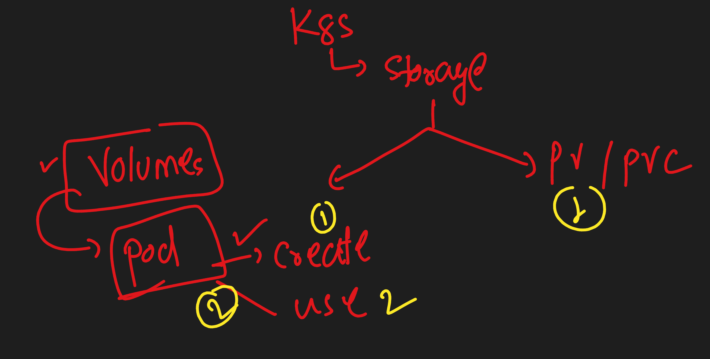
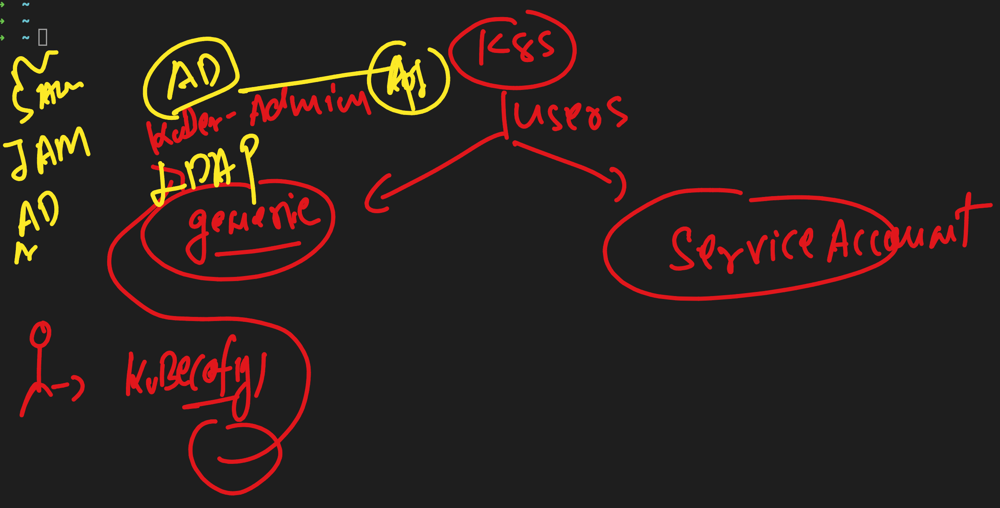

# Roche-EKS

### Creating pod with script 

```
ubectl  create -f day4/ashulogpod.yaml 
pod/ashulogpod created
➜  Roche-EKS git:(master) ✗ kubectl get pods
NAME         READY   STATUS    RESTARTS   AGE
app          1/1     Running   0          157m
ashulogpod   1/1     Running   0          8s
```

### checking data

```
 Roche-EKS git:(master) ✗ kubectl  get po
NAME         READY   STATUS    RESTARTS   AGE
app          1/1     Running   0          158m
ashulogpod   1/1     Running   0          57s
➜  Roche-EKS git:(master) ✗ kubectl  exec -it ashulogpod  -- sh 
/ # cd /mnt/
/mnt # ls
time.txt
/mnt # cat time.txt 
Thu Apr 18 05:30:33 UTC 2024
Thu Apr 18 05:30:38 UTC 2024
Thu Apr 18 05:30:43 UTC 2024
Thu Apr 18 05:30:48 UTC 2024
```

### Storage in k8s 



### using volume 

```
 day4 git:(master) ✗ kubectl replace -f ashulogpod.yaml --force
pod "ashulogpod" deleted
pod/ashulogpod replaced
➜  day4 git:(master) ✗ kubectl  get  po
NAME         READY   STATUS    RESTARTS   AGE
app          1/1     Running   0          3h54m
ashulogpod   1/1     Running   0          8s
➜  day4 git:(master) ✗ kubectl  exec -it  ashulogpod  -- sh 
/ # cd /mnt/data/
/mnt/data # ls
time.txt
/mnt/data # cat  time.txt 
Thu Apr 18 06:46:54 UTC 2024
Thu Apr 18 06:46:59 UTC 2024
Thu Apr 18 06:47:04 UTC 2024
Thu Apr 18 06:47:09 UTC 2024
Thu Apr 18 06:47:14 UTC 2024
Thu Apr 18 06:47:19 UTC 2024
/mnt/data # exit
➜  day4 git:(master) ✗ kubectl  replace -f ashulogpod.yaml --force 
pod "ashulogpod" deleted
pod/ashulogpod replaced
➜  day4 git:(master) ✗ kubectl  exec -it  ashulogpod  -- sh        
/ # cat  /mnt/data/time.txt 
Thu Apr 18 06:46:54 UTC 2024
Thu Apr 18 06:46:59 UTC 2024
Thu Apr 18 06:47:04 UTC 2024
Thu Apr 18 06:47:09 UTC 2024
Thu Apr 18 06:47:14 UTC 2024
Thu Apr 18 06:47:19 UTC 2024
Thu Apr 18 06:47:24 UTC 2024
Thu Apr 18 06:47:29 UTC 2024
Thu Apr 18 06:47:34 UTC 2024
Thu Apr 18 06:47:39 UTC 2024
Thu Apr 18 06:47:44 UTC 2024
Thu Apr 18 06:47:49 UTC 2024
Thu Apr 18 06:47:54 UTC 2024
Thu Apr 18 06:47:59 UTC 2024
Thu Apr 18 06:48:04 UTC 2024
Thu Apr 18 06:48:09 UTC 2024
Thu Apr 18 06:48:14 UTC 2024
Thu Apr 18 06:48:19 UTC 2024
Thu Apr 18 06:48:26 UTC 2024
Thu Apr 18 06:48:31 UTC 2024
Thu Apr 18 06:48:36 UTC 2024
Thu Apr 18 06:48:41 UTC 2024
/ # exit
```

### adding helm repo 

```
 helm repo add  ashu-new-repo  https://charts.bitnami.com/bitnami  
"ashu-new-repo" has been added to your repositories
➜  Desktop 
➜  Desktop helm repo ls                                                      
NAME                	URL                                                     
prometheus-community	https://prometheus-community.github.io/helm-charts      
stable              	https://charts.helm.sh/stable                           
elastic             	https://helm.elastic.co                                 
prometheus-msteams  	https://prometheus-msteams.github.io/prometheus-msteams/
ingress-nginx       	https://kubernetes.github.io/ingress-nginx              
eks                 	https://aws.github.io/eks-charts                        
grafana             	https://grafana.github.io/helm-charts                   
dasmeta-adot        	https://dasmeta.github.io/aws-otel-helm-charts          
ashu-nginx-chart    	https://redashu.github.io/test-helm/                    
datadog             	https://helm.datadoghq.com                              
ashu-repo           	https://charts.bitnami.com/bitnami                      
kubernetes-dashboard	https://kubernetes.github.io/dashboard/                 
ashu-new-repo       	https://charts.bitnami.com/bitnami                   
```

### deploy nginx web using helm 

```
helm install  ashu-app   ashu-new-repo/nginx 
NAME: ashu-app
LAST DEPLOYED: Thu Apr 18 13:14:40 2024
NAMESPACE: ashu-apps
STATUS: deployed
REVISION: 1
TEST SUITE: None
NOTES:
CHART NAME: nginx
CHART VERSION: 16.0.4

```

### running deployment by helm 

```
helm  ls
NAME    	NAMESPACE	REVISION	UPDATED                             	STATUS  	CHART       	APP VERSION
ashu-app	ashu-apps	1       	2024-04-18 13:14:40.826493 +0530 IST	deployed	nginx-16.0.4	1.25.5     
➜  Desktop 

```

## Introduction to RBAC in k8s 



### Creating role in K8s 

```
 kubectl  create role  ashu-pod-read-access  --verb=get --verb=list --verb=watch --resource=pods  -n  ashu-developer --dry-run=client -o yaml
```

### role created

```
kubectl create -f ashu-dev-role.yml 
role.rbac.authorization.k8s.io/ashu-pod-read-access created
➜  rbac git:(master) ✗ kubectl  get roles -n ashu-developer 
NAME                   CREATED AT
ashu-pod-read-access   2024-04-18T09:43:50Z
➜  rbac git:(master) ✗ 
```

### -- binding 

```
 rbac git:(master) ✗ kubectl apply -f .                            
role.rbac.authorization.k8s.io/ashu-pod-read-access configured
role.rbac.authorization.k8s.io/ashu-rolenew1 configured
rolebinding.rbac.authorization.k8s.io/ashu-bind1 created
➜  rbac git:(master) ✗ kubectl  get rolebindings  -n ashu-developer 
NAME         ROLE                        AGE
ashu-bind1   Role/ashu-pod-read-access   12s
```


### accessing prometheus

```
 kubectl  get po -n monitoring 
NAME                                                           READY   STATUS    RESTARTS   AGE
alertmanager-my-kube-prometheus-stack-alertmanager-0           2/2     Running   0          3h31m
my-kube-prometheus-stack-grafana-5457d9fc5c-d7vbb              3/3     Running   0          3h31m
my-kube-prometheus-stack-kube-state-metrics-7854958558-6mbs8   1/1     Running   0          3h31m
my-kube-prometheus-stack-operator-5c99686b64-dfft6             1/1     Running   0          3h31m
my-kube-prometheus-stack-prometheus-node-exporter-b9l69        1/1     Running   0          3h31m
my-kube-prometheus-stack-prometheus-node-exporter-k954l        1/1     Running   0          3h31m
my-kube-prometheus-stack-prometheus-node-exporter-rqk2p        1/1     Running   0          3h31m
my-kube-prometheus-stack-prometheus-node-exporter-vtldb        1/1     Running   0          3h31m
my-kube-prometheus-stack-prometheus-node-exporter-xkgvw        1/1     Running   0          3h31m
prometheus-my-kube-prometheus-stack-prometheus-0               2/2     Running   0          3h31m
➜  /tmp 
➜  /tmp kubectl  get svc  -n monitoring 
NAME                                                TYPE        CLUSTER-IP      EXTERNAL-IP   PORT(S)                      AGE
alertmanager-operated                               ClusterIP   None            <none>        9093/TCP,9094/TCP,9094/UDP   3h32m
my-kube-prometheus-stack-alertmanager               ClusterIP   10.100.200.89   <none>        9093/TCP,8080/TCP            3h32m
my-kube-prometheus-stack-grafana                    ClusterIP   10.100.4.161    <none>        80/TCP                       3h32m
my-kube-prometheus-stack-kube-state-metrics         ClusterIP   10.100.44.18    <none>        8080/TCP                     3h32m
my-kube-prometheus-stack-operator                   ClusterIP   10.100.123.47   <none>        443/TCP                      3h32m
my-kube-prometheus-stack-prometheus                 ClusterIP   10.100.57.26    <none>        9090/TCP,8080/TCP            3h32m
my-kube-prometheus-stack-prometheus-node-exporter   ClusterIP   10.100.97.66    <none>        9100/TCP                     3h32m
prometheus-operated                                 ClusterIP   None            <none>        9090/TCP                     3h32m
➜  /tmp kubectl  port-forward  svc/my-kube-prometheus-stack-prometheus  4455:9090  -n  monitoring 
Forwarding from 127.0.0.1:4455 -> 9090
Forwarding from [::1]:4455 -> 9090
Handling connection for 4455
Handling connection for 4455
Handling connection for 4455

```

### getting password of grafana

```
kubectl get   secrets  my-kube-prometheus-stack-grafana -o yaml  -n monitoring 
apiVersion: v1
data:
  admin-password: cHJvbS1vcGVyYXRvcg==
  admin-user: YWRtaW4=
  ldap-toml: ""
kind: Secret
metadata:
  annotations:
    meta.helm.sh/release-name: my-kube-prometheus-stack
    meta.helm.sh/release-namespace: monitoring
  creationTimestamp: "2024-04-18T08:56:44Z"
  labels:
    app.kubernetes.io/instance: my-kube-prometheus-stack
    app.kubernetes.io/managed-by: Helm
    app.kubernetes.io/name: grafana
    app.kubernetes.io/version: 10.4.1
    helm.sh/chart: grafana-7.3.8
  name: my-kube-prometheus-stack-grafana
  namespace: monitoring
  resourceVersion: "784424"
  uid: c45abe32-e139-4074-9aa2-ed8984be9140
type: Opaque
➜  EKS base64 -d
YWRtaW4=
admin
cHJvbS1vcGVyYXRvcg==
prom-operator


```

